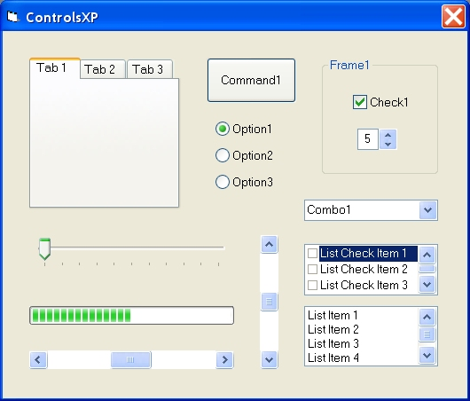



## ControlsXP

### Description

Windows XP Style Controls, You need windows XP, and you must compile the project, work only in the .exe, not in VB
 
### More Info
 

             |
---                |---
**Submitted On**   |2002-12-31 13:38:36
**By**             |[Serge Lachapelle](https://github.com/Planet-Source-Code/PSCIndex/blob/master/ByAuthor/serge-lachapelle.md)
**Level**          |Beginner
**User Rating**    |4.8 (29 globes from 6 users)
**Compatibility**  |VB 5\.0, VB 6\.0
**Category**       |[Custom Controls/ Forms/  Menus](https://github.com/Planet-Source-Code/PSCIndex/blob/master/ByCategory/custom-controls-forms-menus__1-4.md)
**World**          |[Visual Basic](https://github.com/Planet-Source-Code/PSCIndex/blob/master/ByWorld/visual-basic.md)
**Archive File**   |[ControlsXP15211512312002\.zip](https://github.com/Planet-Source-Code/serge-lachapelle-controlsxp__1-42040/archive/master.zip)

